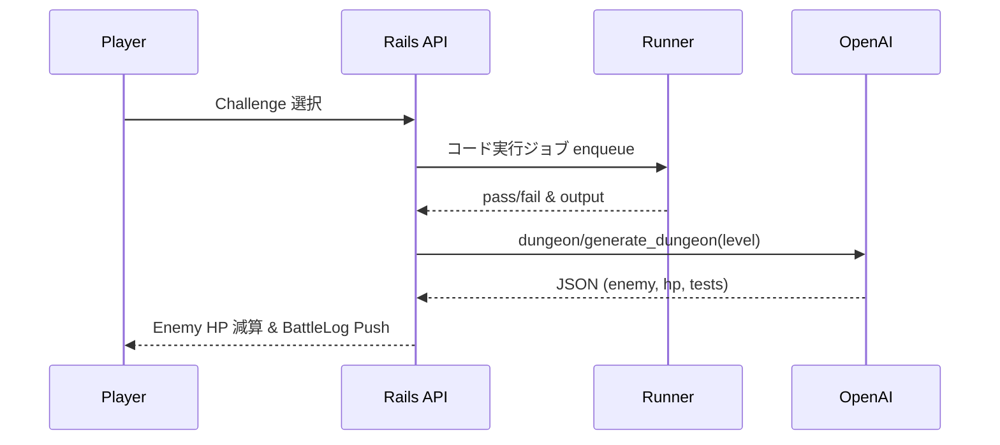

# code_dungeon
AI×RPG コーディング学習ゲーム

提出したコードをDockerコンテナで実行してテストにパスすると敵にダメージを与えられる。

## 目次
1. [背景 / Why](#背景--why)
2. [MVP 機能](#mvp-機能)
3. [ゲームフロー](#ゲームフロー)
4. [技術スタック](#技術スタック)
5. [ローカル環境構築](#ローカル環境構築)
6. [Docker Runner について](#docker-runner-について)
7. [アーキテクチャ図](#アーキテクチャ図)
8. [開発ガイドライン](#開発ガイドライン)
9. [今後のロードマップ](#今後のロードマップ)
10. [ライセンス](#ライセンス)

## 背景 / Why
**学習者が実践的にコードを書きながら楽しめる場を作りたい**  
- 競技プログラミングとゲームの融合  
- ChatGPT / GPT-4o のダンジョン自動生成を活用  

## MVP 機能
- ユーザー登録 & ログイン
- コーディングチャレンジ一覧表示
- コード提出 → テスト実行 → バトル結果表示
- GPT によるダンジョン & 敵データ生成（function calling）
- ActionCable によるリアルタイム HP 更新
- 管理者用チャレンジ追加 UI（簡易）

## ゲームフロー

## 技術スタック
- バックエンド　Ruby 3.3 , Rails 7
- リアルタイム　ActionCable, Redis
- ジョブ       Sidekiq
- Runner       Docker, seccomp, timeout
- AI           OpenAI GPT-4o function calling
- DB           PostgreSQL
- フロント      Hotwire, Tailwaind CSS
- CI/CD        GitHub Actions

## ローカル環境構築

# 前提: Docker Desktop / Git / Ruby 3.3
git clone https://github.com/<your-id>/code_dungeon.git
cd code_dungeon
cp .env.example .env        # OpenAI_KEY などを設定
docker compose up -d        # db, redis 起動
bundle install
bin/rails db:setup
bin/dev                     # foreman: web + vite + sidekiq
# http://localhost:3000 にアクセス

## Docker Runner について
runner/ ディレクトリに Dockerfile を配置

--network=none --security-opt seccomp=profile.json --memory=256m で隔離

Rust 製 “isolate” への差し替えも将来的に検討中

## 開発ガイドライン
- ブランチ戦略: main は常にデプロイ可能 / feature/* は PR 経由でマージ
